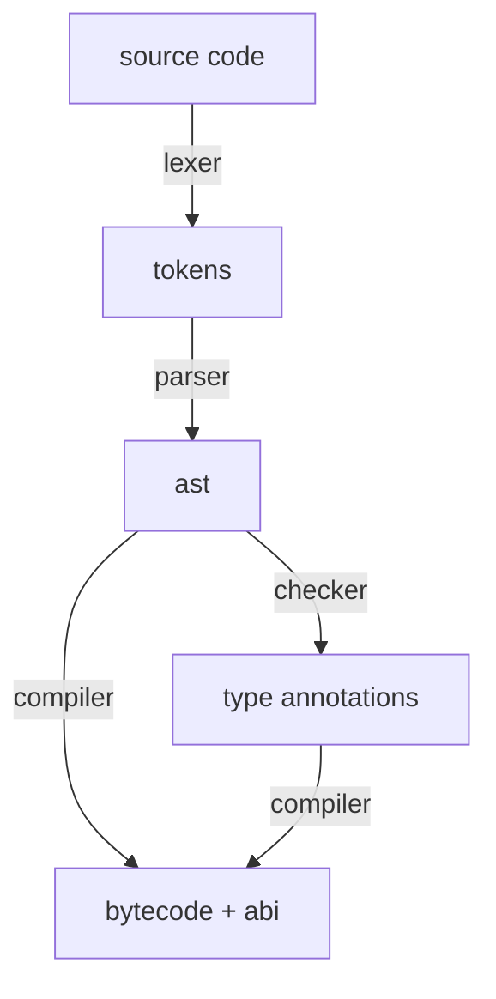

# Allegedly

A fast [Solidity](https://soliditylang.org) compiler for EVM simulations, written in TypeScript.

## Overview

```ts
import { sol } from "allegedly";

const depositContract = "0x...";

const { abi, code } = sol(`
contract GetBalance {
  function run() external returns (uint256) {
    return address(${depositContract}).balance;  
  }
}
`);
```

## [`solc`](https://github.com/ethereum/solidity)

This project is not meant to replace `solc`. Instead, it is a smaller, faster, more modular alternative, that produces less efficient and less secure bytecode.

## Supported Language Features

### Built-in

- [x] `uint{size}()`
- [x] `int{size}()`
- [x] `bytes{size}()`
- [x] `address()`
- [ ] `payable()`
- [x] `bool()`
- [ ] `string()`
- [ ] `bytes()`
- [ ] `abi.encode()`
- [ ] `abi.encodePacked()`
- [ ] `abi.encodeWithSelector()`
- [ ] `abi.encodeWithSignature()`
- [ ] `abi.encodeCall()`
- [ ] `abi.decode()`
- [ ] `bytes.concat()`
- [ ] `string.concat()`
- [ ] `keccak256()`
- [ ] `sha256()`
- [ ] `ripemd160()`
- [ ] `ecrecover()`
- [ ] `addmod()`
- [ ] `mulmod()`
- [ ] `this`
- [ ] `super`
- [ ] `selfDestruct()`
- [ ] `type().name`
- [ ] `type().creationCode`
- [ ] `type().runtimeCode`
- [ ] `type().interfaceId`
- [ ] `type().min`
- [ ] `type().max`
- [ ] `blockHash()`
- [ ] `blobHash()`
- [ ] `gasleft()`
- [x] `block.basefee`
- [x] `block.blobbasefee`
- [x] `block.chainid`
- [x] `block.coinbase`
- [x] `block.difficulty`
- [x] `block.gaslimit`
- [x] `block.number`
- [x] `block.prevrandao`
- [x] `block.timestamp`
- [ ] `msg.data`
- [x] `msg.sender`
- [x] `msg.sig`
- [x] `msg.value`
- [x] `tx.gasprice`
- [x] `tx.origin`

### Contracts

- [x] `interface I { }`
- [x] `contract C { }`
- [ ] `new c()`
- [ ] `new C{ salt }()`

### Types

- [x] `uint{size}`
- [x] `int{size}`
- [x] `bytes{size}`
- [x] `address`
- [ ] `address payable`
- [x] `bool`
- [ ] `string`
- [ ] `bytes`
- [ ] `struct S { }`
- [ ] `enum E { }`
- [ ] `mapping`
- [ ] `{type}[]` (array type)
- [ ] `Contract c` (contract type)
- [ ] `type C is V;` (user defined value type)
- [ ] function type
- [ ] `ufixedMxN`
- [ ] `fixedMxN`

### Statements

- [ ] `if (x) { }`
- [ ] `for (x; x < 10; x++) { }`
- [ ] `while (x) {}`
- [ ] `do { } while (x)`
- [ ] `break`
- [ ] `continue`
- [ ] `return`
- [ ] `unchecked { }`
- [ ] `try` / `catch`

### Expressions

- [x] `x++` or `++x`
- [x] `x--` or `--x`
- [x] `-x`
- [x] `delete x`
- [x] `!x`
- [x] `~x`
- [x] `x + y`
- [x] `x - y`
- [x] `x * y`
- [x] `x / y`
- [x] `x % y`
- [x] `x ** y`
- [x] `x && y`
- [x] `x || y`
- [x] `x == y`
- [x] `x != y`
- [x] `x < y`
- [x] `x <= y`
- [x] `x > y`
- [x] `x >= y`
- [x] `x & y`
- [x] `x | y`
- [x] `x ^ y`
- [x] `x << y`
- [x] `x >> y`
- [x] `x ? y : z`

### Variables

- [ ] `constant`
- [ ] `immutable`
- [ ] `storage`
- [ ] `memory`
- [ ] `calldata`
- [x] `=`
- [ ] `(x, y) = ...`
- [x] `+=`
- [x] `-=`
- [x] `*=`
- [x] `/=`
- [x] `%=`
- [x] `&=`
- [x] `|=`
- [x] `^=`
- [x] `<<=`
- [x] `>>=`

### Functions

- [ ] `fn()`
- [ ] `fn{ value: }()`
- [ ] `fn({x: x})`
- [ ] `pure`
- [ ] `view`
- [ ] `payable`
- [ ] `external`
- [ ] `public`
- [ ] `internal`
- [ ] `private`
- [ ] `constructor`
- [ ] `receive`
- [ ] `fallback`
- [ ] overloading
- [ ] modifers
- [ ] return variables

### Data locations

- [x] memory
- [x] calldata
- [x] returndata
- [ ] storage
- [ ] transient storage

### Directives

- [ ] `import "file.sol";`
- [ ] `pragma solidity major.minor.patch;`
- [ ] `// SPDX-License-Identifier: ...`
- [ ] `using UserType for {type};`

### Address

- [ ] `{address}.balance`
- [ ] `{address}.code`
- [ ] `{address}.codehash`
- [ ] `{address}.call()`
- [ ] `{address}.delegateCall()`
- [ ] `{address}.staticCall()`
- [ ] `{address payable}.send()`
- [ ] `{address payable}.transfer()`

### Arrays

- [ ] `{array}.length`
- [ ] `{array}.push()`
- [ ] `{array}.pop()`

### Literals

- [ ] `hex""`
- [ ] `unicode""`

### Units

- [ ] `wei`
- [ ] `gwei`
- [ ] `ether`
- [ ] `seconds`
- [ ] `minutes`
- [ ] `hours`
- [ ] `days`
- [ ] `weeks`

### Errors

- [x] `none`

### Events

- [x] `none`

### Modifiers

- [x] `none`

### Yul

- [x] none

### Inheritance

- [x] none

### Miscellaneous

## Architecture


